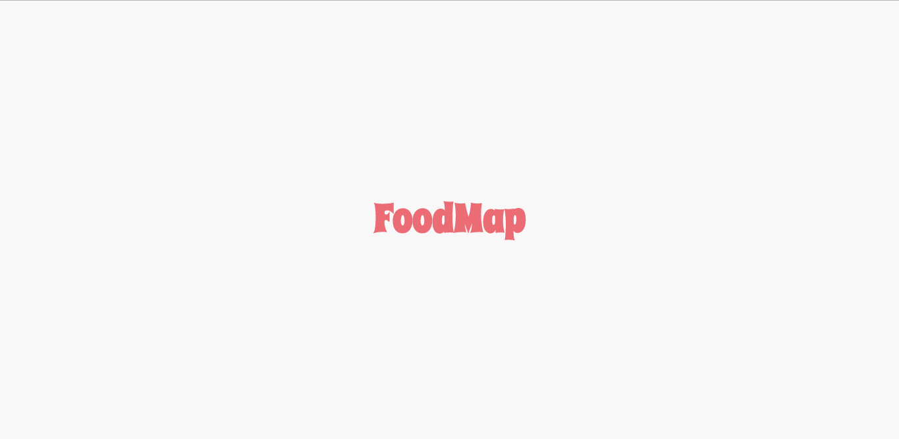

# FOODMAP

En estos días, donde casi todo tiende a ser digitalizado, nos vemos en la necesidad de saber los lugares o puntos de referencia ( en caso de que necesitemos dar información sobre nuestra ubicación), de la misma forma cuando planeamos  una salida con nuestr@s amig@s, o alguna reunión, y si esto es plan de ultima hora, con más razón necesitamos saber los lugares cercanos al que podemos ir o los restaurantes más cercanos a nuestra ubicación. 

Por ello, esta web-app le muestra los restaurantes más cercanos donde usted se encuentre, así mismo tendrá la opción hacer una búsqueda de algún restaurante de entre la lista. En cada una de las opciones de restaurante que listamos, también le detallamos información necesaria como dirección exacta, una breve descripción, teléfono de contacto, referencia, tipo de comida (peruana, italiana, entre otros).

En resumen, usted podrá:

  - Seleccionar una zona en particular. 
  - Buscar de restaurante por nombre. 
  - Ver información sobre un restaurante específico. 

## Herramientas Utilizadas

> Balsamiq, esto para el diseño en baja fidelidad. 
> HTML, para la estructura de la web-app 
> Boostrap, para darle estilos a la web-app 
> Vanilla JavaScript, para darle funcionalildad al proyecto. 

Inicialmente este proyecto lo realicé con css puro, pero a modo de práctica decidí emplear boootstrap, y para una mejor demo también realicé una presentación en figma.  

## Prototipo de baja fidelidad en Balsamiq

### Mobil

### Web

 
 

## FoodMap resultado versión mobile / web

  

## Figma

